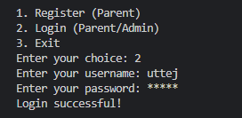

# vaccination-management-system

## Overview

The Child Vaccination Management System is a console-based Node.js application designed to help parents manage their children's vaccination schedules. The application allows parents to register, add their children's details, and book vaccination appointments. It also includes an admin login feature where the admin can view all booked appointments.

## Features

- **User Registration**: Parents can register an account.
- **Login**: Both parents and admin can log in.
- **Child Management**: Parents can add and view their children's details.
- **Appointment Booking**: Parents can book vaccination appointments for their children.
- **Admin Access**: Admin can view all booked appointments, including details about who booked them and what vaccinations were scheduled.

## Requirements

- Node.js (version 14.x or higher)

## Installation

- Clone the repository:
   ```bash
   git clone https://github.com/your-username/vaccination-management-system.git
   cd vaccination-management-system

## Admin Credentials
- Username: admin
- Password: admin123
- The admin credentials are hardcoded for simplicity and can be modified in the users.json file.

## JSON Database
- users.json: Stores user data (parents and admin).
- children.json: Stores details about children.
- appointments.json: Stores vaccination appointments.

## Screenshots

- **Running the Project**:
  
  This screenshot shows the initial running of the Child Vaccination Management System through the command line.

  

- **Registering as a Parent**:

  This screenshot demonstrates the parent registration process where users can create an account.

  

- **Logging in as a Parent**:

  This screenshot illustrates the parent login process, allowing registered parents to access their accounts.

  

- **Adding a Child's Details**:

  This screenshot shows the interface where parents can add details about their children, including name, birthdate, and other relevant information.

  

- **Booking a Vaccination Appointment**:

  This screenshot depicts the process of booking a vaccination appointment for a child. Parents can select available slots and confirm the booking.

  

- **Admin Login**:

  This screenshot shows the admin login process. The admin uses their credentials to access administrative features.

  

- **Viewing All Booked Appointments (Admin)**:

  This screenshot illustrates the admin interface where all booked vaccination appointments are displayed. The admin can see which parent booked the appointment and which vaccinations are scheduled.

  

